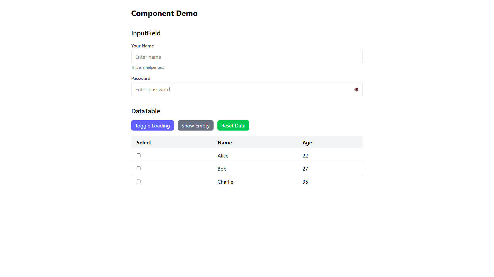
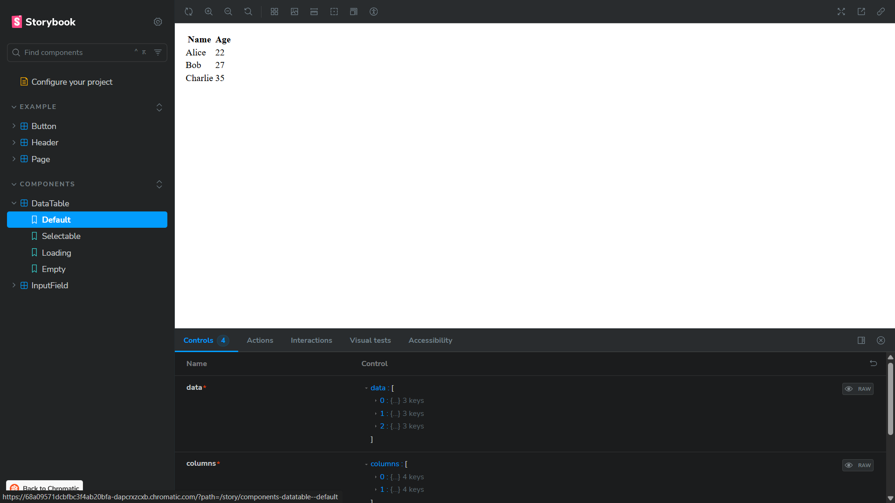
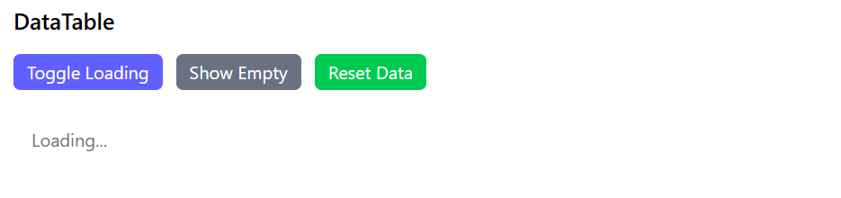
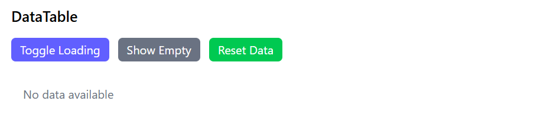

# 🎨 React Component Development Assignment

## 🚀 Overview

This repository contains two reusable React components built using **React, TypeScript, TailwindCSS, and Storybook**:

1. **InputField** – A flexible and accessible input component with validation and multiple states.
2. **DataTable** – A simple yet functional data table with sorting, selection, and loading/empty states.

Both components are documented in **Storybook** and designed with scalability and modern UI patterns in mind.

## 📸 Screenshots









---

## 📂 Project Structure

```
src/
 ├─ components/
 │   ├─ InputField.tsx     # Input component
 │   ├─ DataTable.tsx      # Table component
 │   └─ index.ts
 ├─ stories/
 │   ├─ InputField.stories.tsx
 │   ├─ DataTable.stories.tsx
 ├─ App.tsx
 └─ main.tsx
```

---

## 🎯 Components

### ✅ InputField

A customizable input component with the following features:

- Label, placeholder, helper text, error message
- States: `disabled`, `invalid`, `loading`
- Variants: `filled | outlined | ghost`
- Sizes: `sm | md | lg`
- Optional: Clear button, Password toggle, Light/Dark theme support

**Props:**

```ts
interface InputFieldProps {
  value?: string;
  onChange?: (e: React.ChangeEvent<HTMLInputElement>) => void;
  label?: string;
  placeholder?: string;
  helperText?: string;
  errorMessage?: string;
  disabled?: boolean;
  invalid?: boolean;
  variant?: "filled" | "outlined" | "ghost";
  size?: "sm" | "md" | "lg";
  type?: string;
  clearable?: boolean;
  passwordToggle?: boolean;
}
```

---

### 📊 DataTable

A responsive and accessible table component.

**Features:**

- Display tabular data
- Sorting on columns
- Row selection (single/multiple)
- Loading & Empty states

**Props:**

```ts
interface DataTableProps<T> {
  data: T[];
  columns: Column<T>[];
  loading?: boolean;
  selectable?: boolean;
  onRowSelect?: (selectedRows: T[]) => void;
}

interface Column<T> {
  key: string;
  title: string;
  dataIndex: keyof T;
  sortable?: boolean;
}
```

---

## 🛠️ Tech Stack

- **React (TypeScript)** – Component logic & typings
- **TailwindCSS** – Utility-first styling
- **Storybook** – Component documentation & previews
- **Vite** – Fast development environment

---

## 📘 Storybook Documentation

Run Storybook locally:

```bash
npm run storybook
```

Preview components interactively:

- InputField with all states (default, error, password, etc.)
- DataTable with sorting, selection, loading, and empty states

---

## 🚀 Getting Started

### 1️⃣ Clone Repository

```bash
git clone https://github.com/HarshSharmaIN/uzence-assignment.git
cd "uzence assignment"
```

### 2️⃣ Install Dependencies

```bash
npm install
```

### 3️⃣ Run Development Server

```bash
npm run dev
```

Open [http://localhost:5173](http://localhost:5173) in your browser.

### 4️⃣ Run Storybook

```bash
npm run storybook
```

---

## ✅ Requirements Covered

- [x] TypeScript with proper typing
- [x] Responsive design with TailwindCSS
- [x] Accessibility (labels, aria attributes)
- [x] Clean, modern styling
- [x] Storybook documentation

---

## 📤 Submission Deliverables

- **GitHub Repository** with full source code
- **Storybook Preview Link** (via Chromatic or Vercel)
- **Screenshots/GIFs** (optional)

---

## 📘 Storybook Preview (Chromatic)

Live demo: [View Storybook](https://68a09571dcbfbc3f4ab20bfa-dapcrxzcxb.chromatic.com/)
